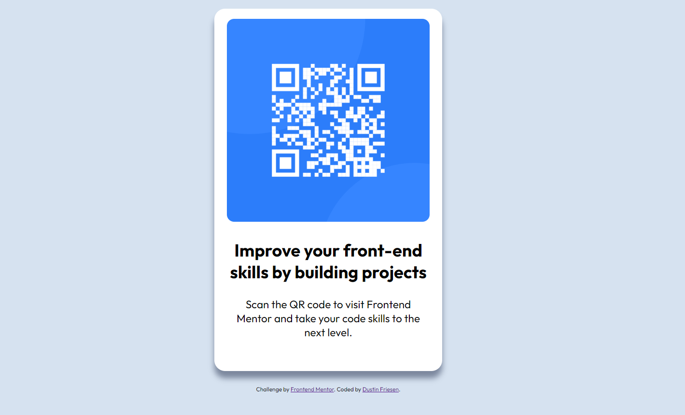

# Frontend Mentor - QR code component solution

This is a solution to the [QR code component challenge on Frontend Mentor](https://www.frontendmentor.io/challenges/qr-code-component-iux_sIO_H). Frontend Mentor challenges help you improve your coding skills by building realistic projects. 

## Table of contents

- [Overview](#overview)
  - [Screenshot](#screenshot)
  - [Links](#links)
- [My process](#my-process)
  - [Built with](#built-with)
  - [What I learned](#what-i-learned)
  - [Continued development](#continued-development)
- [Author](#author)
- [Acknowledgments](#acknowledgments)

**Note: Delete this note and update the table of contents based on what sections you keep.**

## Overview

### Screenshot

### Links

- Solution URL: [Add solution URL here](https://your-solution-url.com)
- Live Site URL: [Add live site URL here](https://your-live-site-url.com)
**github for solution. io for live site.

## My process

I started with HTML structure and added CSS from top down following the HTML flow. 

### Built with

- Semantic HTML5 markup
- CSS custom properties
- Flexbox

### What I learned

I learned that there is a need for both flexbox and margin for centering content. I couldn't get everything to align properly with flexbox alone and had to use text-align and margins.

### Continued development

Learning mobile first workflow.

## Author

- Website - [Add your name here](https://www.your-site.com)
- Frontend Mentor - [@dustinFriesenDev](https://www.frontendmentor.io/profile/yourusername)

## Acknowledgments